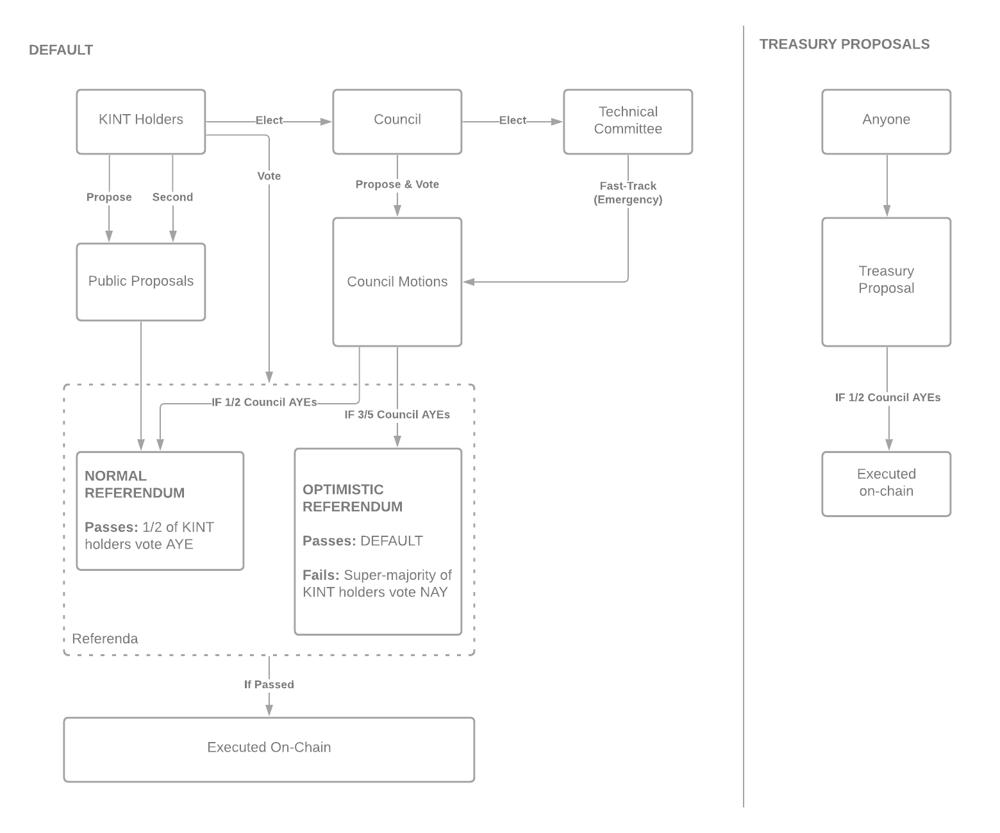

# Decentralized Governance

Kintsugi adopts [Polkadot’s governance mechanism](https://wiki.polkadot.network/docs/learn-governance).

**Council**

Day-to-day decisions are made by an elected council but can be overruled by the majority of KINT holders. The council is democratically elected by KINT holders but anyone can run for office. The term duration is approximately **seven days** after which the council is re-elected.

**Technical Committee (TC)**

The council may elect a technical committee, comprised of developer teams. The TC can fast-track emergency proposals with a shorter voting period, e.g. in case of critical software bugs.

**Optimistic Governance**

To promote a more active governance process and avoid the “lazy voter” problem, Kintsugi implements “optimistic governance”: proposals agreed on by 3/5 of council pass automatically after an “objection period”, unless KINT holders actively vote to oppose. 

**Vote Weighting**

Users may lock KINT with the Kintsugi parachain to increase their voting power - this is known as conviction. The longer KINT are locked, the more voting power they have since the voter has a long-term stake in the health of the system. 

## Parameters

Actual parameters may vary, but the current Kintsugi configuration is listed here.

?> Some periods may be skewed due to slow block production times.

| Parameter                    | Value       | Description |
| ---------------------------- | ----------- | ----------- |
| Enactment Period             | 1 Day       | The period to wait before any approved change is enforced. |
| Launch Period                | 2 Days      | The interval after which to start a new referenda. |
| Voting Period                | 2 Days      | The period to allow new votes for a referendum. |
| Fast-Track Voting Period     | 3 Hours     | The period to allow new votes for a fast-tracked referendum. |
| Super-Majority Threshold     | 1/2 Council | Threshold to schedule a super-majority-required external referendum. |
| Majority-Carries Threshold   | 1/2 Council | Threshold to schedule a majority-carries external referendum. |
| Default-Carries Threshold    | 3/5 Council | Threshold to schedule a negative-turnout-bias (default-carries) external referendum. |
| Fast-Track Threshold         | 2/3 TC      | Used to fast-track an external majority-carries referendum. |
| Cancel Referendum Threshold  | 2/3 Council | Threshold to cancel any active referendum. |
| Cancel Proposal Threshold    | All TC      | Threshold to cancel public proposals. |
| Candidacy Bond               | ~0.003 KINT | Deposit required to submit candidacy. |
| Council Members              | 13          | Total number of seats on the council. |
| Motion Duration              | 3 Days      | The time-out for council motions. |
| Treasury Approval Threshold  | 1/2 Council | Threshold required to approve spending proposal. |
| Treasury Rejection Threshold | 1/2 Council | Threshold required to reject spending proposal. |